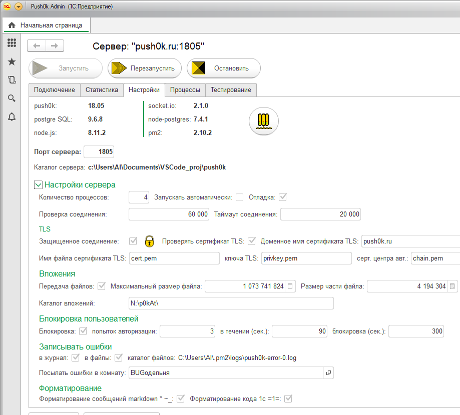
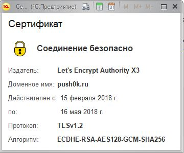

# Сервер push сообщений "push0k"

Сервер использует node.js и модули socket.io, node-postgres, pm2.

Логика сервера push0k, аналогична логотипу, все сообщения пересылаются через сервер. 
* socket.io основной websocket сервер. 
* node-postgres модуль для связи с postgreSQL.
* pm2 используется для запуска балансировки и мониторинга нескольких процессов push0k.js

### Основные файлы сервера

*  **starter.js** - http сервис с авторизацией для управления настройками и запуском процессов сервера push0k.js

* **push0k.js** - websocket сервер, основная логика программы

* **package.json** - описание программы имя, автор, зависимости от модулей

* **config.json** - настройки сервера

* **push0kStructure.sql** - запрос для создания пустой базы данных сервера, в скриптах пока не используется, подробнее в описании "Установки".

Если в качестве сервера используется удаленный VPS, без возможности установить там же win и 1с для административной "push0k admin", или же без возможности настройки VPN до локальной сети где есть win и 1с. В таком случае предполагается ручная правка параметров config.json и ручной запуск скрипта сервера push0k.js 
При таком запуске заранее должны быть заполнены пользователи.
Все пользователи пока видны другу, в дальнейшем доработать сделать настройку выбор ручного заполнения по телефону или через список контактов телефона.
Регистрация новых пользователей пока только через "push0k Admin". Также планирую доработать добавив возможность регистрации с клиентов.

## Клиенты и push0k admin
Сделаны пока только на 1с управляемых формах. Более подробно по ссылке <https://infostart.ru/public/716689/>
Клиенты и push0k admin условно бесплатны.
Платно только дополнения позволяющее использовать шифрование сообщений TLS.

**push0k admin** отдельная конфигурация, рекомендуется локальная файловая установка, т.к. как используются внешние источники данных (нет справочников, документов и.т.д.) и логика предполагает "одного капитана на корабле", если их два и более у каждого должна быть своя локальная файловая база.

Тестирование с скриншота отправка сообщений в тестовую комнату чат, самому порой удивительно всего 50 000 сообщений и 4 250 000 телодвижений: 

отправка 50 000 сообщений: Процессы сервера: 4 Пользователи: 5

1. Всего сообщений получено 50 000 * 5 = 250 000

2. Пересылка в другие процессы сервера 250 000 *  Процессы сервера: 4 - 1 = 750 000

3. Отправлено адресатам  250 000 *  Пользователи: 5 - 1 = 1 000 000

4. Записано сообщений в таблицу postgreSQL 250 000

5. Получено уведомлений доставки 1 000 000

6. Записано в таблицу postgreSQL уведомлений доставки 1 000 000

7. Все операции 4 250 000

В тестах пока максимум 10 000(+-несколько сотен) операций в секунду, при этом количество процессов не влияет. Без разницы 4 пользователя в 4ёх процессах или все на одном процессе. Это говорит о том что процессор в данном тесте не является бутылочным горлышком, узким местом. Знаю windows - не серверная, не самый лучший вариант для запуска сервера из за ограничений сетевого стека.  

**Клиентская часть** доступна в виде внешней обработки, для интеграции обработки в любые типовые-нетиповые базы, предполагается создание расширения. В новое расширение надо только добавить обработку и общую команду. Данные клиентской части сохраняются локально в виде html файлов в директории temp, для каждой базы отдельно. Т.е. нельзя в одной базе в режиме предприятия запустить несколько обработок push0k. Но каталог скачиваемых вложений при этом общий. Например программист поддерживает бухгалтеров и расчетчиков, открыты базы ЗУП и БП и запущены обработки, в базе ЗУП программист может быстро перейти из сообщения в "проблемный" документ ссылку на который прислали расчетчики и аналогично в базе БП. Фактически данные баз БП и ЗУП при этом не содержат информации чата - мессенджера. Это означает что при внешнем аудите, база может быть отдана без данных обсуждения документов. А при внутреннем аудите наоборот полезно видеть какие проблемы - вопросы возникали с тем или иным документом.

Возможно использование шифрования, логика практически аналогична браузерам и вид тоже.
Проверяется доменное имя, самоподписанность и срок.

### Безопасноть
Для авторизации в базе сохраняется двойной хеш sha256. При авторизации используется хеш от сохраненного хеша + УИД текущего соединения "соленый хеш".
Т.е. перехваченный хеш не позволит авторизоваться повторно, и не раскроет текущий пароль.
При установке нового пароля, хеш нового пароля запаковывается в запароленый zip архив, пароль на zip = старый пароль + УИД соединения.
В целом описанное выше означает что важные личные данные даже без использование TLS хорошо зашищены.
Но в целом конечно надежнее использовать TLS соединения.

Во всех запросах postgreSQL используются параметры, это гарантирует защиту от SQL инеьекций.
При отправке сообщений проверяется отправитель с авторизованным пользователем.

### Вариант использования

Если представить некий абстрактный «Интернет сервис» для взаимодействия таких же абстрактных программ на смартфонах и компьютерах, то подобный сервис обязательно должен иметь пару возможностей:
1. авторизовывать подключенных пользователей 
2. доставлять информацию с сервера на клиент.

Вышеописанное практически равнозначно логике любого мессенджера, только без интерфейса.

Дабы отойти от сферичных коней в вакууме и  было более лучшее понимание.
К примеру требуется создать приложение для «коллекционеров»:

	На компьютере пользователь ведет базу вносит информацию о предмете
	коллекционирования, стоимость покупки, номер полки и ячейки в шкафу и или кляйстере.
	Предметы коллекции могут быть куплены или обменяны в интернете. К практически 
	каждому предмету храняться фотографии, как для интернет деятельности так и для души 
	коллекционера. Получается склад с адресным хранением количественным и суммовым 
	учетом. И практически  все тоже самое пользователь может повторить на телефоне, 
	плюс добавить фото прямо с телефона.
	
	Для синхронизации обоих баз данных смартфона и компьютера в режиме реального времени 
	незаметно для пользователя удобней всего использовать то что описано выше и по итогу 
	названо «месенджером». Тот же механизм но уже по прямому назначению можно 
	использовать, для общения «коллекционеров».

Больше возможных вариантов использования описанно по ссылкам <https://infostart.ru/public/716689/> 
<https://infostart.ru/public/545047/>

## Установка

1. Первоначально должен быть установлен postgresql 9.6
Рекомендуется версия для linux <https://postgrespro.ru/products/1c_build>
PostgreSQL может быть установлен как на том же хосте вместе с push0k.js так и на другом хосте локальной сети. В теории может использоваться любой postgreSQL но практике не пробывал. Доработанные 1С типы данных не используются, поэтому привязки к postgreSQL из ссылки нет. 

2. Создать базу данных в postgreSQL и загрузить структуру файл push0kStructure.sql

3. Установить node.js 
* linux -  <https://nodejs.org/en/download/package-manager/> 
* windows - <https://nodejs.org/en/download/>

4. Установить 7zip 
* windows https://sourceforge.net/projects/sevenzip/files/7-Zip/18.05/
* linux ubuntu http://help.ubuntu.ru/wiki/7zip 

5. Скачать файлы проекта в определенный каталог например o:\push0k
* Открыть терминал, в windows ПКМ -> Пуск -> "Командная строка" или "Windows PowerShell".
* Перейти в каталог, команда в терминале: `cd o:\push0k`

* Установить дополнительные модули. С помощью команды терминала: `npm install`
* Отредактировать параметры подключения к postgreSQL в файле **config.js** заполнить структуру **pgconf**, свойства **host**, **port**, **database**, **user**, **password** также можно изменить **aport** - порт starter.js
* Запустить сервер администрирования команда: `node starter.js` (в ubuntu вместо `node` использовать `nodejs`). 

Если не используется push0k admin, то последним пунктом вместо команды:  ``node starter.js`` надо выполнить:  `pm2 start push0k.js -i 0`. 	
Где параметр: `-i 0` это количество процессов `0` означает количество по количеству ядер процессора.

## Быстрая установка в контейнере docker

Контейнер состоит из: Ubuntu 16.04, PostgreSQL 9.6, node.js 8.11 + push0k 1805

#### Запуск, команды консоли
Загрузить образ:

`docker pull ploal/push0k`

Создать и запустить контейнер из образа:

`docker run --name push0k -d --restart=always --net host --tmpfs="/var/lib/postgresql/9.6/main/pg_stat_tmp:rw,noatime,nodiratime,size=500M,mode=700,uid=799,gid=799" ploal/push0k:1806 /usr/bin/supervisord -c /etc/supervisor/supervisord.conf`

После выполнения второй команды можно подключаться к контейнеру 
* **порт администрирования push0k:** `2016`
* **порт сервера postgreSQL:** `5432`
Сетевой ip адрес совпадает с адресом компьютера где установлен docker. По умолчанию в postgreSQL устанавливается пароль `YourPassword`. Пароль можно изменить в консоли контейнера команда: `sudo -u postgres psql -c "ALTER USER postgres WITH PASSWORD 'YourPassword'"`

Если контейнер запускается в более ранней версии docker 17.05, из строки запуска следует убрать параметр `--tmpfs="/var/lib/postgresql/9.6/main/pg_stat_tmp:rw,noatime,nodiratime,size=500M,mode=700,uid=799,gid=799"` , данный параметр создает RAM диск для записи статистики postgreSQL, в версиях ниже 17.05 параметр недоступен.

Я также использую данный контейнер в качестве 1с сервера. Для установки 1c сервера, достаточно перенести распакованные установочные файлы *.deb , внутрь контейнера. Перейти в консоли **контейнера** в каталог куда перенесены установочные файлы `cd /YourCatalog/withSetupDebs` и запустить установку командой `dpkg -i *.deb` после установки для автоматического запуска сервера надо отредактировать файл `/etc/supervisor/supervisord.conf` в файле надо убрать комментарии в виде символов ";" с секции `;[program:1csvr]` и строки под ней `;command=/opt/1C/v8.3/...`

Для переноса файлов внутрь контейнера рекомендуется настроить и использовать примонтированную папку "public", также возможна масса других вариантов: поиск напрямую в папках aufs, установка настройка samba, запуск ssh.
Для поиска и редактирования файла `/etc/supervisor/supervisord.conf` проще всего воспользоваться старым добрым полношным коммандэром для этого набрать в консоли `mc`
