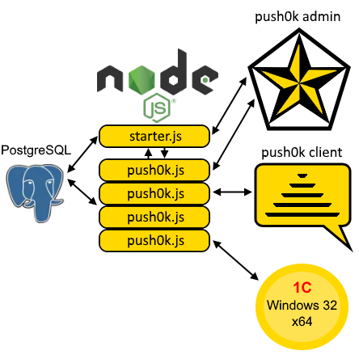
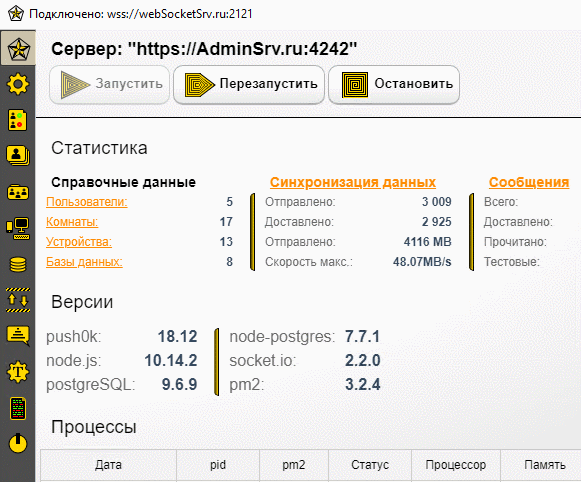
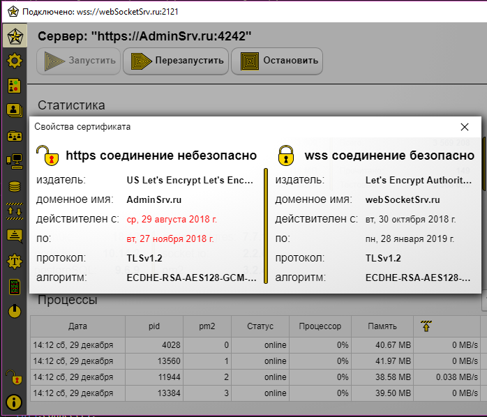
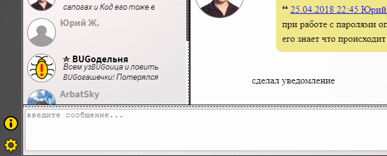
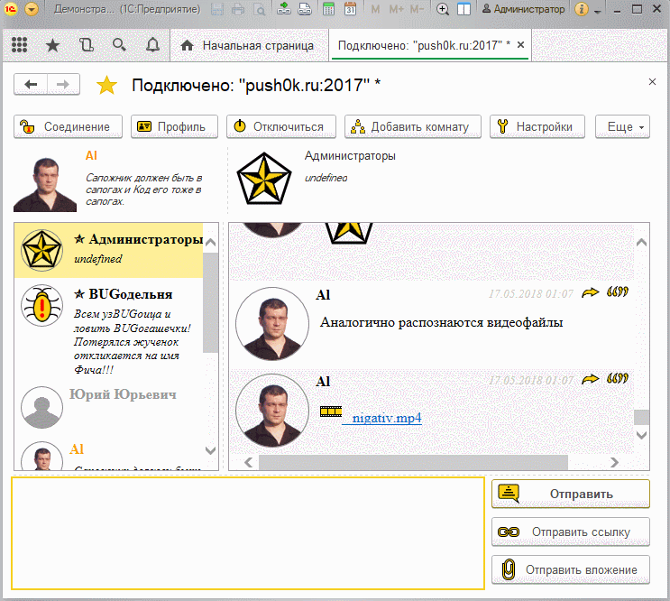

# Сервер push сообщений "push0k"

Сервер использует node.js и модули socket.io, node-postgres, pm2.

Логика сервера push0k, аналогична "звездному" логотипу, все сообщения пересылаются через сервер. 
* socket.io основной websocket сервер. 
* node-postgres модуль для связи с postgreSQL.
* pm2 используется для запуска балансировки и мониторинга нескольких процессов push0k.js

### Основные файлы сервера

*  **starter.js** - http сервис с авторизацией для управления настройками и запуском процессов сервера push0k.js

* **push0k.js** - websocket сервер, основная логика программы.

* **starter_cfg.js** — настройки административной скрипта сервера. Подключение к postgreSQL и файлы для https подключения. Файлы для https подключения, так и доменное имя, могут отличаться от основного сервера, для большей безопасности. Изменяется вручную, при первом запуске.

* **config.json** - основные настройки всего сервера.

* **package.json** - описание программы имя, автори и необходимые для работы дополнительные модули.

* **push0kStructure.sql** - файл описание базы данных postgreSQL для начальной инициализации, пустой базы данных, подробнее в описании "Установки".

## Установка

1. Первоначально необходимо установить node.js https://nodejs.org/en/download/

2. Также должен быть установлен postgreSQL на компьютере локальной сети или том же https://postgrespro.ru/products/download
На сервере postgreSQL, необходимо выполнить файл «push0kStructure.sql» или практически все запросы из этого файла для создания базы данных с необходимыми таблицами.

3. Скачать первые пять файлов сервера, кроме push0kStructure.sql, в любой каталог компьютера.

4. В любом текстовом редакторе отредактировать файл «starter_cfg.js». Важно  указать параметры подключения к postgreSQL серверу и установить порт для подключения к административной части сервера push0k. 

5. Запустить терминал (консоль) и с помощью команды «cd /путь/вашего/каталога/» перейти в каталог файлов сервера. Указанный в команде терминала путь должен быть из пункта 3.

6. Выполнить команду в терминале «npm install» для установки дополнительных модулей.
Выполнить команду в терминале «node starter.js» для запуска сервиса  администрирования.

7. Скачать и установить программу push0k admin. В «push0k admin» настраиваются основные параметры websocket, порт сервера, количество процессов и многие другие. Можно управлять запуском и остановкой процессов сервера, создавать и управлять пользователями и их комнатами(группами). 

**Администратор:** +7 (999) 777-77-77 
**Пароль**: 777

Установка всего необходимого в контейнере docker: Ubuntu 16.04, PostgreSQL 9.6, node.js 10.15 + push0k 19.01 https://github.com/PloAl/push0k_Dockerfile

### push0k admin
Скачать для Windows: [push0kadmin Setup 19.1.11.exe](https://yadi.sk/d/Jw675Octd4w3DA)

Скачать для Mac OS: [push0kadmin-19.1.11.dmg](https://yadi.sk/d/q8EsRIm-FxL_Ww)

**push0k admin** приложение сделано на electron с использованием vue.js . Внутри реализовано подобие оконной системы, небольшие модальные диалоги можно перетаскивать как окна, заголовки окон для windows сделаны аналогично windows 10, для Mac OS как в последних версиях, но пока без учета dark theme. Для linux соберу позднее, там с заголовками диалогов чуть сложнее, думаю будет как в ubuntu и если не ubuntu то win 10 style. Потребление памяти в win 10 и Mac OS больше 150 мегабайт не видел.

В предыдущих версиях не было возможности добавить анимацию, сделал немного без фанатизма. Ранее описанные диалоги — окна появляются из центра окна приложения постепенно увеличиваясь, при закрытии улетают в центр уменьшаясь. Также анимированно нажатие кнопок и обязательные для заполнения поля.

Более подробное описание по ссылке: https://habr.com/ru/post/438388
  
### Безопасноть
Для управления используются http и ws (websocket) протоколы. Есть возможность использовать защищенные соединения https и wss. Для безопасности отдельно http и ws могут использоваться различные доменные имена. При защищенных соединениях можно посмотреть данные используемых сертификатов. Аналогично браузерам используется пиктограмма «Замок» - соединение безопасно, «Открытый замок» - соединение небезопасно. И без пиктограмм, соответственно — защищенное соединение не используется.

Для авторизации в базе сохраняется двойной хеш sha256. При авторизации используется хеш от сохраненного хеша + УИД текущего соединения "соленый хеш".
Т.е. перехваченный хеш не позволит авторизоваться повторно, и не раскроет текущий пароль.
В целом описанное выше означает что важные личные данные даже без использование TLS хорошо зашищены.
Но в целом конечно надежнее использовать TLS соединения.

Во всех запросах postgreSQL используются параметры, это гарантирует защиту от SQL иньекций.
При отправке сообщений проверяется отправитель с авторизованным пользователем.

### push0k client

Скачать для Windows: [push0kclient Setup 19.2.22.exe](https://yadi.sk/d/rJZzq_4-ka-zlg)

Скачать для Mac OS: [push0kclient-19.2.22.dmg](https://yadi.sk/d/Oojb4wJN6IAfcw)

При разработке клиентской части, не было цели повторить и сделать дизайн как у других.
С другой стороны, поменять и сделать новое расположение областей в десктоп версии сложно. Область контактов слева, сообщения справа, область ввода нового сообщения снизу, сделать лучше и удобней не так просто. Во многих современных решениях дизайн и элементы дизайна едины с мобильными программами. Думаю, именно поэтому, поле ввода сообщения невозможно расширить, сделать две и более строки.

На картинке видна прерывистая линия разделитель, при наведении она становится желто-черно- полосатой. Передвигая разделитель, можно отрегулировать высоту поля для ввода сообщений. 
Аналогично можно изменить ширину списка контактов и списка сообщений. 
Отправка сообщений анимирована, какой либо анимации при отправке сообщений в других программах не было.

Более подробное описание по ссылке: https://habr.com/ru/post/439414/

### Клиентская часть 1с
Клиентская часть 1с доступна в виде внешней обработки, для интеграции обработки в любые типовые-нетиповые базы, предполагается создание расширения. В новое расширение надо только добавить обработку и общую команду. Данные клиентской части сохраняются локально в виде html файлов в директории temp, для каждой базы отдельно. Т.е. нельзя в одной базе в режиме предприятия запустить несколько обработок push0k. Но каталог скачиваемых вложений при этом общий. Например программист поддерживает бухгалтеров и расчетчиков, открыты базы ЗУП и БП и запущены обработки, в базе ЗУП программист может быстро перейти из сообщения в "проблемный" документ ссылку на который прислали расчетчики и аналогично в базе БП. Фактически данные баз БП и ЗУП при этом не содержат информации чата - мессенджера. Это означает что при внешнем аудите, база может быть отдана без данных обсуждения документов. А при внутреннем аудите наоборот полезно видеть какие проблемы - вопросы возникали с тем или иным документом.

Более подробно по ссылке [https://infostart.ru/public/716689/](https://infostart.ru/public/716689/)

### Тестирование
Встроенный механизм, позволяет имитировать большое количество пересылаемых сообщений. И по результам позволяет понять какую нагрузку может выдержать сервер.

Тестирование с скриншота отправка сообщений в тестовую комнату чат, самому порой удивительно всего 10 000 сообщений и 390 000 операций: 

отправка 10 000 сообщений: Процессы сервера: 4 Пользователи: 3

1. Всего сообщений получено 10 000 * 3 = 30 000

2. Пересылка в другие процессы сервера 30 000 *  Процессы сервера: 4 - 1 = 90 000

3. Отправлено адресатам  30 000 *  Пользователи: 3 - 1 = 60 000

4. Записано сообщений в таблицу postgreSQL 30 000

5. Получено уведомлений доставки 60 000

6. Записано в таблицу postgreSQL уведомлений доставки 60 000

7. Все операции 390 000

Показанный результат далеко не предел, т.к. не загружены все процессы. Один из отправителей находился на том же хосте. Да и сам хост виртуальная машина ESXi. 
Отличие тестовых от остальных сообщений:
* Тестовые сообщения не записываются на клиентах, и не попают при синхронизации данных.
* Для тестовых сообщений, не используются процедуры форматирования markdown. 
* Остальные сообщения после форматирования markdown также отсылаются отправителю.  